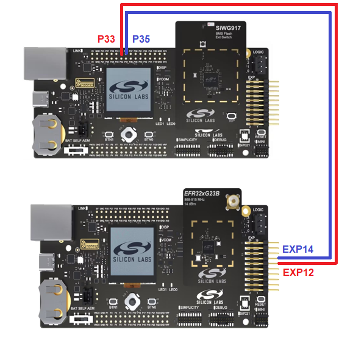
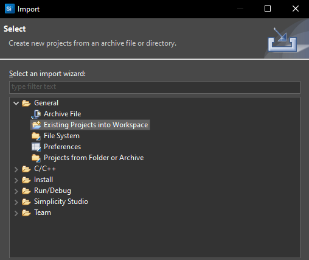
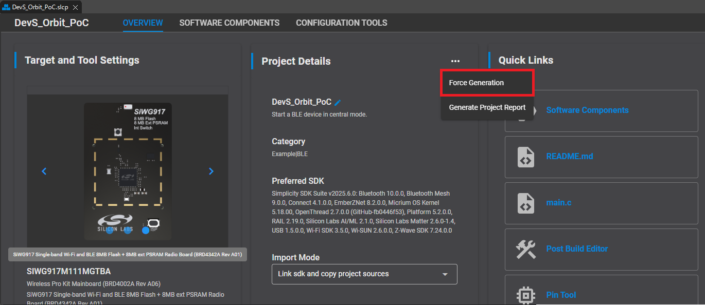
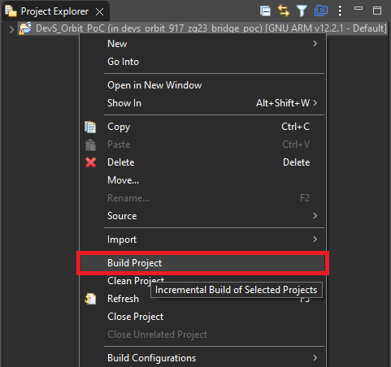
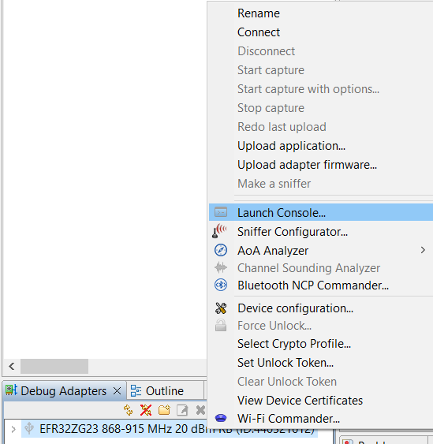

# Wi-Fi/Z-Wave Long Range (LR) Bridge Gateway

This project demonstrates a Wi-Fi/Z-Wave Long Range (LR) bridge gateway. The gateway acts as a bridge between Z-Wave devices and TLS servers, enabling communication and control via a TLS socket connection.

## Hardware requirements
- BRD4002A Mainboard + BRD4342A Radio Board (SiWx917 Bridge)
- BRD4002A Mainboard + EFR32xG23 Radio Board (Z-Wave NCP Controller)
- BRD4001A Mainboard + EFR32xG23 Radio Board (Z-Wave End Device)

## Hardware Setup
Connect UART_TX, UART_RX, and GND from the Expansion Header on the Z-Wave NCP Controller board to P33 (UART_TX), P35 (UART_RX), and GND on the SiWx917 Bridge, respectively.

<p align="center">
  
</p>

## Build environment setup
### Windows

1. **Install Dependencies**  
   - [Simplicity Studio 5](https://www.silabs.com/developers/simplicity-studio)  
   - [Simplicity SDK v2025.6.0](https://github.com/SiliconLabs/simplicity_sdk/releases/tag/v2025.6.0)

2. **Apply Patch to Simplicity SDK**
   This project requires a patch to enable lwIP packet info functionality, which is not available in the standard SDK distribution.
   
   Navigate to the Simplicity SDK folder and apply the `sisdk.patch` file from the project directory:

   ```sh
   git apply /path/to/sisdk.patch
   ```

3. **Import the Project**  
   In Simplicity Studio 5, select:  
   `File` → `Import...` → `More Import Options...` → `Existing Project into workspace`

   <p align="center">
     
   </p>

4. **Generate SLCP File**  
   Open the `.slcp` file and select `Force Generation`.

   <p align="center">
     
   </p>

5. **Build the Project**

   <p align="center">
     
   </p>

---

### Linux

1. **Install Dependencies**

   ```sh
   sudo apt-get install make
   ```

2. **Clone and Download Dependencies**
   - [Simplicity SDK v2025.6.0](https://github.com/SiliconLabs/simplicity_sdk/releases/tag/v2025.6.0)
   - [WiseConnect SDK v3.5.0](https://github.com/SiliconLabs/wiseconnect/releases/tag/v3.5.0)
   - [GNU Toolchain](https://developer.arm.com/-/media/Files/downloads/gnu/12.2.rel1/binrel/arm-gnu-toolchain-12.2.rel1-x86_64-arm-none-eabi.tar.xz)
   - [SLC CLI](https://www.silabs.com/documents/login/software/slc_cli_linux.zip)
   - [Simplicity Commander](https://www.silabs.com/documents/login/software/SimplicityCommander-Linux.zip)

3. **Apply Patch to Simplicity SDK**
   This project requires a patch to enable lwIP packet info functionality, which is not available in the standard SDK distribution.
   
   Navigate to the Simplicity SDK folder and apply the `sisdk.patch` file from the project directory:

   ```sh
   git apply /path/to/sisdk.patch
   ```

4. **Set Environment Variables**  
   Replace the paths below with your actual installation locations:

   ```sh
   export SIMPLICITY_SDK_DIR=~/path/to/simplicity_sdk
   export WISECONNECT_SDK_DIR=~/path/to/wiseconnect_sdk
   export ARM_GCC_DIR=~/path/to/arm-gnu-toolchain
   export SLC_CLI_DIR=~/path/to/slc_cli
   export POST_BUILD_EXE=~/path/to/SimplicityCommander
   ```

5. **Build Command**  
   Run the following command to build the project:

   ```sh
   ./projects/script/build b4342a -p
   ```

   The build output will be located in `build/b4342a/slc/si91x_zg23/build/debug/`.

---

## Debug Environment

Logs from the Bridge and NCP can be monitored using Simplicity Studio 5.

<p align="center">
  
</p>

---

## Contributing

Please follow the [CONTRIBUTING](./.github/CONTRIBUTING.md) guidelines.

---

## License

See the [LICENSE.md](./LICENSE.md) file for details.
